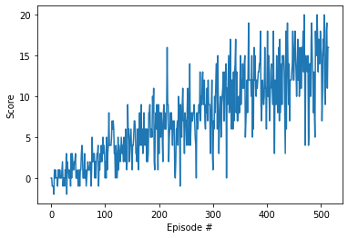
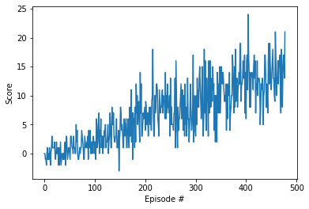

# Summary

My submission contains models for two agents, I trained separatly. For the first one, I only used DQN while for the second one I applied Double DQN. Otherwise, I used Q-target and Replay Buffer for both of them.

# Methods
## 1. DQN
A **DQN**, or **Deep Q-Network**, approximates a state-value function in a Q-Learning framework with a neural network.

NN Structure : State -> 64 -> 64 -> Action

## 2. DDQN
The DDQN prevents the agent from overestimating the state-value function. I used the same net structure as for DQN which led to good results. But it can be perfected by tuning hyperparameters. Due to a lack of time, I didn't do the tuning.

# Results

The final score is about 13.12 obtained after 515 episodes for the DQN Method.

  

The final score is about 13.05 obtained after 478 episodes for the DDQN.

  

# In Future Works

## Prioritized Experience Replay (PER)

Experience replay lets online reinforcement learning agents remember and reuse experiences from the past. In prior work, experience transitions were uniformly sampled from a replay memory. However, this approach simply replays transitions at the same frequency that they were originally experienced, regardless of their significance. To replay important transitions more frequently, and therefore learn more efficiently, we use prioritized Experience Replay

## Dueling Agents (DA)

Dueling networks utilize two streams: one that estimates the state value function `V(s)`, and another that estimates the advantage for each action `A(s,a)`. These two values are then combined to obtain the desired Q-values.

## Rainbow
We can utilize the Rainbow Method `(DDQN + PER + DA)` which already led the ***Google Deepmind*** team to successfully train a complex agent efficiently and rapidly.